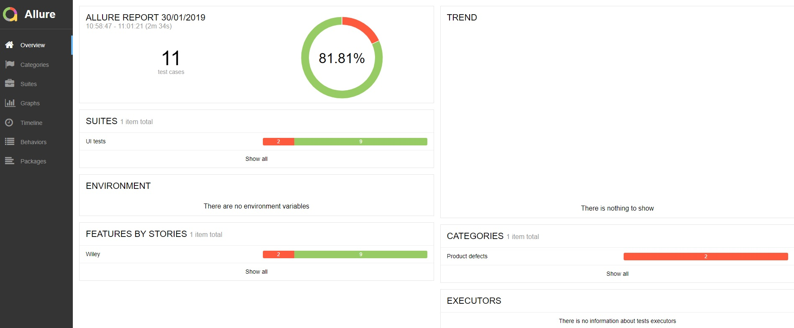
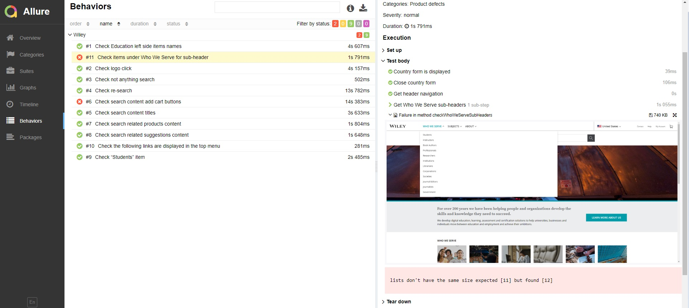

# Запуск автотестов 

## Запуск UI автотестов
(Должны быть установлены и настроены maven, allure)
#### Перейти в каталок с тестами 
#### Выполнить команду: mvn clean test -P ui
#### Для генерации отчета выполнить команду: allure serve target/allure-results

## Запуск API автотестов
(Должен быть установлен и настроен maven)
#### Перейти в каталок с тестами 
#### Выполнить команду: mvn clean test -P api

## Main

## Screenshot

